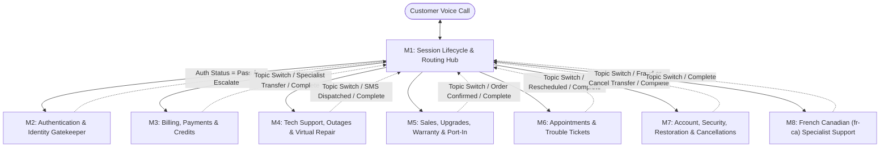

# Product Requirements Document (Reconciled v2.0)

## Product Name
**Telco Voice Central (Bell Voice Central) — AI Voice Assistant**

---

## Executive Summary — PRD vs. Public Evals Gap Analysis & Reconciliation

A comprehensive audit of the baseline **Day 2 (DFCX to CXAS) PRD: Telco Voice Central AI Voice Assistant** against the **70 Public Simulation Evaluations (`dfcx__cxas_agent_migration_public_evals`)** identified **15 critical functional, compliance, security, and architectural gaps**.

This v2.0 PRD reconciles every gap to ensure 100% alignment between product specifications, CXAS agent instructions/tools/callbacks, and the 70 public evaluation scenarios.

### Summary of Identified Gaps & Reconciliations

| Gap ID | PRD Section Affected | Public Eval Scenarios Covered | Baseline PRD Gap / Discrepancy | v2.0 Reconciled Specification |
| :--- | :--- | :--- | :--- | :--- |
| **GAP-01** | Sec 2 (M7), Sec 4, Sec 6 | `sim__cancel_service_internet_english`, `sim__cancel_service_mobility_french`, `sim__port_out_number_english`, `sim__cancel_tv_service_english`, `sim__cancel_home_phone_french` | M7 scope omits Service Cancellation & Port-Out; Section 4 lacks verbatim **Mandatory Contract Disclosure** strings (EN/FR); Section 6 lacks a Cancellation/Port-Out CUJ. | Added Cancellation & Port-Out across Internet, Mobility, TV, and Home Phone to M7; added `contract_disclosure_cancellation` & `contract_disclosure_port_out` verbatim copy in EN & FR; added **CUJ-8**. |
| **GAP-02** | Sec 1 (`BR-TV-021`), Sec 6 | `sim__speak_immediate_english`, `sim__speak_immediate_french`, `sim__speak_mid_call_billing_english`, `sim__speak_frustrated_english`, `sim__speak_mid_call_tech_french` | No global rule or CUJ guaranteeing immediate human representative transfer on Turn 1 or mid-call without forcing authentication or self-service deflection. | Added **BR-TV-021 (Unconditional Live Representative Handoff)** mandating immediate verbatim `live_agent_handoff` transfer at any turn in EN/FR; added **CUJ-9**. |
| **GAP-03** | Sec 1 (`BR-TV-006`, `BR-TV-008`), Sec 2 (M2) | `sim__dispute_charge_auth_retry`, `sim__manage_mfa_auth_failure`, `sim__reset_password_wrong_number_retry` | Unclear behavior on 1st/2nd failed PIN/OTP attempts vs 3rd strike, and no specification for wrong phone/account number recovery during identification. | Explicitly codified: 1st/2nd failed PIN/OTP prompts in-flow retry while preserving pending intent; 3rd failure triggers live-agent escalation. Invalid phone/account numbers during identification prompt inline correction (e.g., fallback to 9-digit account number). |
| **GAP-04** | Sec 2 (M3), Sec 6 | `sim__pay_mobility_bill_card_file`, `sim__pay_bill_french_keypad`, `sim__pay_past_due_bill_prevent_suspension`, `sim__pay_bill_declined_card_retry` | M3 scope omits one-time Bill Payment processing (card on file, DTMF keypad, past-due immediate payment) and card decline business-error recovery. | Added full Bill Payment capabilities to M3 (saved card with last-4 echo per `BR-TV-009`, French DTMF keypad entry, past-due clearance) and **Card Decline Recovery** (prompting for secondary card on tool business error); added **CUJ-10**. |
| **GAP-05** | Sec 1 (`BR-TV-019`), Sec 2 (M3), Sec 5 | `sim__setup_autopay_internet_english`, `sim__setup_autopay_french`, `sim__setup_autopay_after_paying_bill`, `sim__manage_mfa_pivot_tech`, `sim__reset_password_pivot_billing` | Does not specify session authentication persistence across compound sequential intents or autopay bank account support. | Codified **Session Auth Persistence**: once `auth_status == Pass`, authentication persists across multi-intent pivots (e.g., Pay Bill $\rightarrow$ Setup Autopay; Enable MFA $\rightarrow$ Tech Support) without re-authentication. Added Bank Account / Pre-Authorized Debit support to Autopay. |
| **GAP-06** | Sec 1, Sec 2 (M3), Sec 3, Sec 6 | `sim__dispute_unrecognized_streaming_charge`, `sim__dispute_billing_charge_french`, `sim__request_credit_outage_days`, `sim__request_refund_overcharge_french`, `sim__request_refund_exceeding_threshold_escalation` | Policy threshold ($25.00) only mentioned in passing in CUJ-2; omits overcharge refunds, outage downtime credits, and specialist escalation workflow for $> \$25.00$. | Codified **$25.00 Self-Service Credit/Refund Threshold Rule**: disputes, overpayments, and verifiable outage downtime credits $\le \$25.00$ auto-process with verbatim `refund_confirmation_pattern`. Requests $> \$25.00$ (e.g., $150 equipment charge) authenticate first, then escalate via verbatim `transfer_to_specialist`. |
| **GAP-07** | Sec 3, Sec 4 | `sim__check_outage_active_postal_code`, `sim__check_outage_french_active`, `sim__check_outage_none_found_sms_troubleshoot` | Section 3 wrongly requires `Authenticated` for all `"Internet is down"` calls; Section 4 has **6 truncated French Canadian verbatim strings (`...`)**. | Fixed Section 3: Regional Outage Check by Postal Code operates at **Guest / Identified** tier (no PIN/OTP required) and offers SMS troubleshooting when no outage is active. Replaced all 6 truncated French verbatim strings in Section 4 with complete, production-compliant French copy. |
| **GAP-08** | Sec 1 (`BR-TV-006`), Sec 2 (M6) | `sim__check_tech_status_standard`, `sim__check_ticket_status_french`, `sim__check_tech_status_reschedule_pivot`, `sim__check_ticket_status_retry_strikes` | M6 omits open trouble ticket status lookup (`statut de mon billet`), dynamic delay-to-reschedule pivoting, and silent-turn strike reset behavior. | Expanded M6 to cover both installation appointments and repair tickets (`statut de mon billet`); added dynamic pivot from delayed technician status directly into offering 2–3 reschedule slots; clarified `local_noinput_counter` resets to 0 on Turn 3 valid input. |
| **GAP-09** | Sec 2 (M7), Sec 3 | `sim__reset_password_standard`, `sim__reset_password_french`, `sim__reset_password_sms_escalation`, `sim__reset_password_pivot_billing` | No fallback when SMS password reset link fails to arrive; unclear tiered step-up when pivoting from `Identified` to `Authenticated`. | Added **SMS Non-Receipt Escalation Rule** (escalating to live agent via `live_agent_handoff` if caller reports SMS link not received) and seamless tiered step-up (prompting only for PIN/OTP when pivoting from Password Reset to Billing). |
| **GAP-10** | Sec 2 (M7), Sec 3, Sec 6 | `sim__manage_mfa_disable`, `sim__manage_mfa_enable`, `sim__manage_mfa_french_disable`, `sim__manage_mfa_auth_failure` | Section 3 treats Enable MFA and Disable MFA identically (`Yes + Step-Up Auth`). Evals enforce asymmetric security. | Codified **Asymmetric MFA Security Rules**: **Enabling MFA** requires standard `Authenticated` (PIN/OTP); **Disabling MFA** strictly requires `Authenticated` (PIN/OTP) **PLUS Step-Up Verification Code sent to backup email**. Added **CUJ-11**. |
| **GAP-11** | Sec 1 (`BR-TV-013`), Sec 2 (M7), Sec 3, Sec 6 | `sim__report_fraud_standard`, `sim__report_fraud_french`, `sim__report_fraud_phishing`, `sim__report_fraud_mid_call_switch`, `sim__report_fraud_sim_swap` | Fraud definition only mentions generic "hacked account"; risks misrouting SIM Swap victims to Tech Support or failing mid-call billing fraud discovery. | Expanded Fraud taxonomy to explicitly include: (1) Turn 1 hacked/unauthorized claims, (2) Phishing/scam SMS reports, (3) **Suspected SIM Swap / sudden mobile service loss with number theft concern**, and (4) **Mid-call discovery of unauthorized billing charges**. All bypass/abort self-service, emit verbatim `empathy_protocol`, and trigger immediate `fraud_escalation`. Added **CUJ-12**. |
| **GAP-12** | Sec 2 (M7/M3), Sec 6 (`CUJ-6`) | `sim__restore_service_standard`, `sim__restore_service_french`, `sim__restore_service_payment_arrangement`, `sim__restore_service_already_paid`, `sim__restore_service_business_deflection` | CUJ-6 only describes immediate balance payment; misses Payment Arrangements for callers unable to pay today and Prior Payment Verification for recent payments. | Expanded Service Restoration into **Three Mandatory Paths**: (1) Immediate Full Payment, (2) **Structured Payment Arrangement (Promise-to-Pay)**, and (3) **Prior Payment Verification (verifying payments made yesterday without double-charging)**, plus Business Deflection (`business_handoff`). |
| **GAP-13** | Sec 2 (M4), Sec 5, Sec 6 | `sim__troubleshoot_tv_signal`, `sim__troubleshoot_mobile_service_french`, `sim__troubleshoot_satellite_tv_error`, `sim__troubleshoot_mobile_data_slow`, `sim__troubleshoot_tv_app_freezing` | PRD only details outage checks; lacks interactive Virtual Repair diagnostics across TV sub-types (`streaming`, `satellite`, `streaming_only`) and Mobility network issues. | Added granular **Virtual Repair Diagnostic Matrix** covering Fibe TV Receiver (`no signal` HDMI/reboot), Satellite TV (`Error 101` dish/receiver recovery), Fibe TV App (`streaming_only` cache clear/reinstall), and Mobility (`aucun service` vs `slow cellular data` network reset). Added **CUJ-13**. |
| **GAP-14** | Sec 2 (M5), Sec 3, Sec 6 | `sim__upgrade_mobile_plan_data`, `sim__upgrade_internet_speed_french`, `sim__upgrade_tv_package_sports`, `sim__upgrade_mobile_plan_budget`, `sim__upgrade_internet_wfh`, `sim__warranty_replacement_*` (5 evals), `sim__transfer_number_*` (3 evals) | Section 3 lists Plan Upgrades as `Recommended (Identified)` (violating `BR-TV-008`); omits budget/WFH filtering, TV sports add-on, Warranty damage exclusion & swollen battery rules, and Port-In parameter schema. | Reclassified Plan/Package Upgrades as strictly **Authenticated (`BR-TV-008`)**; added budget ($\le \$60/\text{mo}$) & WFH bandwidth filtering; codified **Device Warranty Rules** (coverage check, mandatory physical/water damage exclusion check, urgent swollen battery dispatch); codified **Number Port-In Schema** (temp Bell number, external number, prior carrier account/PIN for competitor mobile, landline-to-mobile, and family plan add-a-line). Added **CUJ-14**. |
| **GAP-15** | Sec 6, Sec 7 | All 70 Public Simulation Evaluations | Section 6 has only 7 CUJs; Section 7 references an outdated "806 deterministic and simulation evaluation suites" metric without mapping to the 70 public evals. | Expanded Section 6 to **14 Core CUJs** (mapping 1:1 to all 14 evaluation families / 70 public simulations) and updated Section 7 benchmarks to explicitly require **$\ge 90\%$ pass rate across the 70 Public Simulation Evaluations and migrated deterministic unit tests**. |

---

## Executive Summary

**Telco Voice Central (Bell Voice Central)** is a voice-first, bilingual conversational customer service application for a major Canadian telecommunications provider (Bell Canada). Serving residential and mobility subscribers across Canada in English (`en-CA`) and Canadian French (`fr-CA`), the assistant resolves the six primary customer contact domains—**Billing & Payments, Technical Support & Outages, Sales & Equipment (Upgrades, Warranty & Port-In), Appointments & Trouble Tickets, Account & Security Management (Password, MFA, Service Restoration, Cancellations/Port-Out, Fraud), and Live Representative Handoffs**—through self-contained generative automation or context-preserving live-agent escalation.

The product replaces rigid legacy touch-tone IVR and deterministic speech trees with a consolidated Customer Experience Agent Studio (CXAS) multi-agent architecture while strictly enforcing 3-tier authentication (`Guest` $\rightarrow$ `Identified` $\rightarrow$ `Authenticated`), verbatim regulatory disclosures, PII redaction, and zero data hallucination.

---

## Problem Statement

Telecom customers calling support face frustrating, rigid IVR trees where slight phrasing variations, bilingual nuances, or multi-domain inquiries result in misrouting, repetitive authentication prompts, or long hold times.

Furthermore, real-world telecom calls frequently involve **mid-call pivots and compound intents**—such as a caller paying a past-due bill and immediately enrolling in autopay, checking a delayed technician appointment and pivoting to reschedule, or inquiring about a high bill balance and discovering unauthorized charges that require immediate fraud escalation. Legacy IVRs cannot preserve session state or authentication across these pivots, causing high abandonment and unnecessary live-agent transfers.

---

## Goals & Non-Goals

### Goals
- **Voice-Friendly Resolution**: Deliver natural, concise spoken responses (under 50 words / 300 characters per breath span where feasible) across Mobility, Internet (Fibe/DSL), TV (Fibe TV Receiver, Satellite TV, Fibe TV App), and Home Phone services.
- **Strict 3-Tier Auth Ladder & Session Persistence**: Enforce `Guest` $\rightarrow$ `Identified` $\rightarrow$ `Authenticated` transitions before exposing or mutating account data, while **persisting authenticated status across multi-intent pivots within the same session**.
- **Proactive Outage & Interactive Virtual Repair**: Check regional outage databases by postal code at `Guest/Identified` tier, offer proactive SMS restoration notifications, and guide authenticated callers through device-specific Virtual Repair diagnostics (Fibe TV HDMI/reboot, Satellite Error 101, Streaming App freezing, Mobility network resets) or dispatch SMS troubleshooting guides.
- **Bilingual Excellence (`en-CA` & `fr-CA`)**: Detect language at Turn 1, lock language for the entire session (self-service through specialist transfer), support French DTMF keypad entry, and emit complete, untruncated French Canadian compliance strings.
- **Graceful Topic Switching & Escalation**: Seamlessly re-classify and re-route mid-call pivots, honor unconditional human agent requests at any turn (`BR-TV-021`), deflect business accounts immediately (`BR-TV-012`), and transfer fraud reports (including phishing and SIM swap) with zero authentication friction (`BR-TV-013`).
- **Verbatim Compliance**: Strictly emit all legal, privacy, contract cancellation/port-out, refund, business handoff, and specialist transfer disclosures verbatim without LLM paraphrasing (`BR-TV-011`).

### Non-Goals
- Do not process unauthorized financial transactions or store raw credit card CVV numbers in plaintext.
- Do not disclose Personally Identifiable Information (PII), account balances, or ticket details to unauthenticated callers (`BR-TV-008`, `BR-TV-009`).
- Do not process self-service billing credits or refunds exceeding the **$25.00 policy threshold** without escalating to a billing specialist (`transfer_to_specialist`).
- Do not approve device warranty replacements if the caller reports physical damage or liquid/water damage.
- Do not promise guaranteed technician arrival times or speculative outage restoration times without backend tool confirmation (`BR-TV-017`).

---

## Target Audience

- **Residential Subscribers**: Customers managing Fibe/DSL Internet, Fibe TV (IPTV/App), Satellite TV, or Home Phone landline services (upgrades, outages, cancellations, landline-to-mobile porting).
- **Mobility Subscribers**: Smartphone users managing cellular data plans, budget-constrained upgrades ($\le \$60/\text{mo}$), warranty replacements (iPhone, Samsung, Pixel), number port-ins (competitor or family plan add-a-line), and network/SIM troubleshooting.
- **Bilingual Callers**: Canadian consumers interacting in English or Canadian French (`fr-CA`).
- **Distressed / Urgent Callers**: Customers facing service suspension for non-payment, swollen phone batteries, account takeover/phishing/SIM swap fraud, or urgent technician delays.
- **Business Callers (Deflection Target)**: Commercial/business account holders who must be identified immediately via `business_flag` and deflected to dedicated business support representatives.

---

## Section 1 — Global Behavioral Requirements Register (`BR-TV-001` to `BR-TV-021`)

The agent must strictly satisfy all **21 global behavioral requirements**:

| ID | Name | Core Behavioral Requirement |
| :--- | :--- | :--- |
| **BR-TV-001** | **Recording Notice** | The regional privacy disclosure (`recording_notice`) is emitted verbatim on the initial greeting. If asked, the agent repeats it verbatim. |
| **BR-TV-002** | **Restricted Caller Check** | Incoming Caller ID (`clid`) is checked against a blocklist before greeting; blocked calls hear a deflection message and disconnect immediately. |
| **BR-TV-003** | **Regional Service Alert** | Active regional service alerts prepend an advisory banner to the standard greeting. |
| **BR-TV-004** | **Language Locking** | Language (`en` or `fr-ca`) is detected at Turn 1 and locked in session state (`language`) for the entire call. Only an explicit caller request switches language. |
| **BR-TV-005** | **Module Coverage** | Every customer intent must accurately classify and route to the correct functional capability module (`M1` through `M8`). |
| **BR-TV-006** | **Retry Strikes & Strike Reset** | 3 consecutive no-input turns (`local_noinput_counter == 3`), 3 unresolved no-match events (`no_match_confirmation_count == 3`), or 3 consecutive failed PIN/OTP authentication attempts trigger graceful live-agent escalation (`no_input_escalation` / `disambig_max_attempts` / `live_agent_handoff`). **Crucial Recovery Rule**: If a caller is silent for 1 or 2 turns (e.g., distracted) or enters 1 or 2 wrong PINs/identifiers and then provides valid input on Turn 3, the respective error counter resets to `0` and the conversation proceeds normally. |
| **BR-TV-007** | **DTMF Capture** | Spoken or telephone keypad DTMF entries (account numbers, PINs, payment confirmations in English or French) are normalized and written to session variable `dtmf_digits` on the arrival turn. |
| **BR-TV-008** | **Strict 3-Tier Auth Ladder & Persistence** | Enforce `Guest` $\rightarrow$ `Identified` $\rightarrow$ `Authenticated`. Account reads, billing lookups/payments, plan upgrades, warranty claims, number port-ins, and service cancellations strictly require `Authenticated` (`auth_status == Pass`). Once `Authenticated` is achieved in a session, **authentication persists across all subsequent intra-module and cross-module pivots** without re-prompting for PIN/OTP. |
| **BR-TV-009** | **PII Redaction** | Account numbers (`billing_account`), customer reference numbers (`cirn`), and credit card numbers are spoken back and logged as **last-4 digits only**. 4-digit PINs and 6-digit SMS OTP codes are **never echoed**. |
| **BR-TV-010** | **Tool-Error Tri-State & Recovery** | System errors end session immediately or escalate (`global_err_count`); **business errors surface to the model to offer alternative options** (e.g., if a payment credit card is declined, gracefully prompt the caller to provide a secondary/alternative credit card and retry); validation errors prompt inline retry (e.g., unrecognized phone number prompts fallback to 9-digit account number). |
| **BR-TV-011** | **Verbatim Compliance** | All legal, privacy, contract cancellation/port-out, refund confirmation, business handoff, empathy, outage, and specialist transfer strings in Section 4 must be emitted **verbatim** in the locked language without model contraction, truncation, or paraphrasing. |
| **BR-TV-012** | **Business Handoff** | Whenever a caller states they are calling about a business account or account lookup sets `business_flag == True` (across Billing, Tech Status, or Service Restoration), the agent immediately emits verbatim `business_handoff` and transfers to a commercial representative without attempting residential self-service or PIN/OTP auth. |
| **BR-TV-013** | **Fraud & Compromise Escalation** | Any report of account hacking, unauthorized charges (Turn 1 or discovered mid-call during billing review), phishing/scam SMS messages, or **suspected fraudulent SIM swap (sudden loss of mobile service with number theft concern)** immediately aborts self-service, emits verbatim `empathy_protocol`, and executes immediate transfer (`fraud_escalation`) to the Fraud Specialist queue **without requiring authentication**. |
| **BR-TV-014** | **After-Hours Awareness** | Outage and Fraud queues operate 24/7. Sales, plan changes, and appointment scheduling route to next-business-day callback scheduling when queues are closed. |
| **BR-TV-015** | **Session-Context Handoff** | Every live-agent or specialist escalation carries the full session variable payload (`clid`, `billing_account`, `auth_status`, `language`, `route`, conversation summary) to the receiving representative's console. |
| **BR-TV-016** | **Malicious Utterance** | Classifier hits for abusive, profane, or malicious input terminate the session immediately with reason `malicious_input`. |
| **BR-TV-017** | **No Invented Data** | If a tool lookup fails or returns empty, the agent must never fabricate account balances, plan prices, warranty dates, or technician ETAs. Generation is strictly conditioned on tool outputs. |
| **BR-TV-018** | **Audio Recording** | Every voice interaction produces an archived session recording verified by compliance audits. |
| **BR-TV-019** | **Mid-Call Topic Switch & Compound Intents** | The agent must dynamically re-classify and re-route whenever the caller pivots mid-call (e.g., Password Reset $\rightarrow$ Billing Balance; Enable MFA $\rightarrow$ Tech Support; Check Tech Status $\rightarrow$ Reschedule Appointment; Pay Bill $\rightarrow$ Setup Autopay) while retaining all established identity and authentication state. |
| **BR-TV-020** | **Language Non-Degradation** | A call initiated in French (`fr-ca`) or English (`en`) must remain strictly in that language throughout all self-service modules, tool error recoveries, verbatim disclosures, and transfer handoffs to a matching bilingual representative. |
| **BR-TV-021** | **Unconditional Live Representative Handoff** | If the caller explicitly requests to speak to a human representative/person/agent at **Turn 1 or at any point mid-call** (e.g., `"I want to talk to a person"`, `"Representative, please!"`, `"Je veux parler à un représentant"`), the agent immediately bypasses/aborts self-service and authentication, emits verbatim `live_agent_handoff` in the active language, and executes transfer. |

---

## Section 2 — Capability Modules Architecture (`M1` – `M8`)

The conversational application is structured into **8 Functional Capability Modules (`M1` – `M8`)** operating in a Hub-and-Spoke / Routed Specialist topology:

### Module Responsibilities & Volume Breakdown

| Module | Name | Call Volume | Reconciled Purpose, Scope & Business Rules |
| :--- | :--- | :--- | :--- |
| **M1** | **Session Lifecycle & Routing** | Entry / Exit (100%) | Emit verbatim `recording_notice` and `greeting_main`; run blocklist check (`BR-TV-002`) and regional alerts (`BR-TV-003`); detect and lock language (`en` or `fr-ca`); capture DTMF input (`dtmf_digits`); handle unconditional human agent requests (`BR-TV-021`); orchestrate cross-module mid-call topic switches (`BR-TV-019`); manage 3-strike error counters (`BR-TV-006`); execute closing sign-off. |
| **M2** | **Authentication & Identity** | Gatekeeper | Manage 3-tier ladder (`Guest` $\rightarrow$ `Identified` $\rightarrow$ `Authenticated`). Identify accounts via 10-digit phone number or 9-digit `billing_account` (with inline retry if wrong number entered). Authenticate via 4-digit PIN (`id_verification_pin`) or 6-digit SMS OTP (`id_verification_otp`), supporting spoken or DTMF keypad input. Allow up to 2 retry attempts on incorrect PIN/OTP; escalate to live agent on 3rd failure. Detect `business_flag == True` and trigger immediate `business_handoff`. |
| **M3** | **Billing, Payments & Credits** | ~25% | **Requires `Authenticated`**. Look up balances and itemized charges; process one-time **Bill Payments** via saved credit card on file (speaking back last-4 digits only per `BR-TV-009`), new credit card, or French DTMF keypad; handle **Card Decline Recovery** by prompting for an alternative credit card; enroll accounts in **Autopay** (via Credit Card or Bank Account / Pre-Authorized Debit), including sequential `Pay Bill -> Setup Autopay` flows; process **Charge Disputes, Overpayment Refunds, and Outage Downtime Credits** strictly within the **$\le \$25.00$ self-service threshold** (emitting verbatim `refund_confirmation_pattern`). For credit/refund requests **$> \$25.00$** (e.g., $150 returned equipment charge), authenticate caller and escalate via verbatim `transfer_to_specialist`. Support **Payment Arrangements** for suspended/past-due callers. |
| **M4** | **Tech Support, Outages & Virtual Repair** | ~30% | **Tiered Auth**: Regional **Outage Checks by Postal Code** operate at `Guest / Identified` tier (no PIN/OTP required); if active outage found, emit verbatim `outage_active` and offer proactive SMS restoration alerts. If no outage is active, proactively offer an **SMS Troubleshooting Guide**. For interactive **Virtual Repair Diagnostics** (`Authenticated`), disambiguate service/device sub-type (`lob` and `tv_sub_type`) and execute targeted workflows: (1) **Fibe TV Receiver (`no signal`)**: HDMI cable verification & receiver reboot; (2) **Satellite TV (`Error 101`)**: Satellite signal acquisition & receiver recovery specific to Error 101; (3) **Fibe TV App (`streaming_only` / app freezing)**: Cache clear & app reinstall; (4) **Mobility Network (`no service / aucun service` vs `slow cellular data`)**: Network settings reset, SIM check, and data speed diagnostics (or SMS guide dispatch). |
| **M5** | **Sales, Upgrades, Warranty & Port-In** | ~15% | **Requires `Authenticated` for all account mutations/orders (`BR-TV-008`)**. (1) **Plan & Package Upgrades**: Present 2–3 curated options across Mobility data tiers, Home Internet speed tiers (including **Work-From-Home bandwidth profiles**), and **TV Add-On Packages (e.g., Sports Channel Package)**; support **strict monthly budget filtering (e.g., $\le \$60/\text{month}$)**; capture selection and confirm order/ETA. (2) **Device Warranty Replacement**: Check warranty coverage status by purchase date (`sim__warranty_replacement_check_status`); enforce **Mandatory Physical & Liquid Damage Exclusion Check** (must confirm zero physical/water damage); support iPhone (screen flickering), Samsung (charging failure), and Google Pixel (dead microphone); handle **Urgent Safety Defects (swollen battery / `batterie gonflée`)** with priority replacement dispatch. (3) **Number Port-In (Transfer to Bell)**: Collect required porting payload (**temporary Bell number, external phone number to transfer, and previous carrier account number/PIN**) for Competitor Mobile port-in, **Wireline/Landline-to-Mobile conversion**, and **Family Plan Add-a-Line port-in**. |
| **M6** | **Appointments & Trouble Tickets** | ~10% | **Requires `Authenticated`**. Look up active field installation appointments (`Where is my technician?`) and open repair/trouble tickets (`statut de mon billet`); report real-time technician en-route/delay status; **dynamically pivot from delayed technician status directly into offering 2–3 reschedule time slots**; commit appointment reschedules or cancellations and dispatch SMS confirmation. Deflect business lines via `business_handoff`. |
| **M7** | **Account, Security, Restoration & Cancellations** | ~15% | Manage 5 high-compliance account lifecycles: (1) **Password Reset (`Identified` tier)**: Verify account via phone/account number (with retry on wrong number) and dispatch 30-minute valid SMS reset link; **escalate to live agent (`live_agent_handoff`) if caller reports SMS not received**. (2) **MFA Management**: **Enabling MFA** requires standard `Authenticated` (PIN/OTP); **Disabling MFA** requires `Authenticated` (PIN/OTP) **PLUS Step-Up Verification Code sent to registered backup email**. (3) **Fraud & Compromise Escalation (`Guest/Unauthenticated`)**: Immediately detect Turn 1 or mid-call reports of hacked accounts, unauthorized billing charges, phishing/scam texts, or **suspected SIM swap**, emit verbatim `empathy_protocol`, and transfer via `fraud_escalation`. (4) **Service Restoration (`Authenticated`)**: Support 3 paths for suspended lines—Immediate Full Balance Payment (via M3), **Structured Payment Arrangement (Promise-to-Pay)**, and **Prior Payment Verification (verifying payment made yesterday and restoring without duplicate charge)**. (5) **Service Cancellation & Number Port-Out (`Authenticated`)**: Process cancellations for Home Internet, Mobility, Fibe TV, and Home Phone landline, as well as Mobile Number Port-Out to external carriers; **strictly emit verbatim Mandatory Contract Disclosure (`contract_disclosure_cancellation` / `contract_disclosure_port_out`)** and capture explicit caller confirmation before executing cancellation. |
| **M8** | **Secondary Language Fallback (`fr-ca`)** | Variable | Provide native French Canadian (`fr-ca`) conversational execution, DTMF capture, regional Quebec postal code outage handling (e.g., `G1R 4A6`), and complete French verbatim compliance copy across all M1–M7 capabilities without language degradation (`BR-TV-020`). |

---

## Section 3 — Reconciled Intent Coverage & Routing Table

| Representative Caller Utterance | Route To | Auth Required (Reconciled) | Mandatory Special Handling / Rules |
| :--- | :--- | :--- | :--- |
| `"I want to talk to a person"` / `"Representative, please!"` / `"Je veux parler à un représentant"` | **Live Agent Handoff (M1)** | **None (Immediate Transfer)** | Emit verbatim `live_agent_handoff` at Turn 1 or mid-call (`BR-TV-021`). |
| `"Someone hacked my account"` / `"Fraud"` / `"Scam text asking for PIN"` / `"Lost service, suspect SIM swap"` | **M7 (Account - Fraud)** | **None (Immediate Empathy + Escalation)** | Emit verbatim `empathy_protocol` + immediate `fraud_escalation` transfer (`BR-TV-013`). |
| `"Dispute a charge on my business account"` / `"Check tech status for business line"` / `"Restore suspended business line"` | **Business Queue Deflection (M1/M2)** | **None (Immediate Business Deflection)** | Upon `business_flag == True`, emit verbatim `business_handoff` and transfer (`BR-TV-012`). |
| `"Check if there is an internet outage in postal code H3Z 2Y7"` / `"Panne dans mon secteur G1R 4A6"` | **M4 (Tech Support - Outage)** | **Guest / Identified (Postal Code only)** | Check outage API by postal code. If active: verbatim `outage_active` + SMS alert opt-in. If none: offer SMS troubleshooting guide. |
| `"Forgot my password"` / `"Reset login"` / `"Réinitialiser mon mot de passe"` | **M7 (Account - Password)** | **Identified (Phone or 9-digit Account #)** | Dispatch 30-min SMS link. Allow retry on wrong phone #. **Escalate to live agent if SMS link is not received.** |
| `"My bill is wrong"` / `"Dispute a $12.50 streaming charge"` / `"Credit for 3 days internet outage"` / `"Refund overpayment"` | **M3 (Billing - Disputes & Credits)** | **Yes (`Authenticated` via PIN/OTP)** | Auto-approve credits/refunds **$\le \$25.00$** with verbatim `refund_confirmation_pattern`. If **$> \$25.00$** (e.g. $150 modem charge), escalate via verbatim `transfer_to_specialist`. |
| `"I want to pay my bill"` / `"Pay mobility balance with card on file"` / `"Payer ma facture avec le clavier"` | **M3 (Billing - Payments)** | **Yes (`Authenticated` via PIN/OTP or DTMF)** | Echo saved card as **last-4 digits only** (`BR-TV-009`). If primary card declines, **prompt for alternative card & retry**. |
| `"Set up autopay"` / `"Pay my bill first, then set up autopay"` / `"Paiements préautorisés"` | **M3 (Billing - Autopay)** | **Yes (`Authenticated` - persists across turns)** | Support Credit Card or Bank Account. In sequential `Pay Bill -> Autopay`, **do not re-authenticate**. |
| `"Restore my suspended service"` / `"Can't pay full balance today, need payment arrangement"` / `"Already paid yesterday"` | **M7 (Account) $\leftrightarrow$ M3 (Billing)** | **Yes (`Authenticated` via PIN/OTP)** | Support 3 paths: (1) Pay full balance, (2) **Set up Payment Arrangement**, or (3) **Verify payment made yesterday & restore**. |
| `"Enable MFA"` / `"Turn on two-factor authentication"` | **M7 (Account - MFA Enable)** | **Yes (`Authenticated` via PIN/OTP)** | Standard primary authentication sufficient to enable MFA. |
| `"Disable two-factor"` / `"Lost authenticator phone, disable MFA"` / `"Désactiver l'authentification multifacteur"` | **M7 (Account - MFA Disable)** | **Yes (`Authenticated`) + Step-Up Email Auth** | Requires primary PIN/OTP **PLUS Step-Up verification code sent to registered backup email**. Escalate on 3 auth failures. |
| `"Cancel my internet/mobility/TV/home phone service"` / `"Port out my mobile number to another carrier"` | **M7 (Account - Cancellations & Port-Out)** | **Yes (`Authenticated`) + Mandatory Contract Disclosure** | Must emit verbatim `contract_disclosure_cancellation` or `contract_disclosure_port_out` in EN/FR and capture explicit confirmation. |
| `"TV says no signal"` / `"Satellite TV Error 101"` / `"Fibe TV app freezing"` / `"Cellular data slow"` / `"Aucun service mobile"` | **M4 (Tech Support - Virtual Repair)** | **Yes (`Authenticated` via PIN/OTP)** | Route to device-specific interactive diagnostic flow (HDMI/reboot, Error 101 recovery, App cache/reinstall, Mobile network reset) or SMS guide. |
| `"Where is my technician?"` / `"Check ticket status (statut de mon billet)"` / `"Tech is delayed, reschedule my appointment"` | **M6 (Appointments & Tickets)** | **Yes (`Authenticated` via PIN/OTP)** | Report en-route/ticket status. If technician is delayed, **pivot seamlessly to offer 2–3 reschedule slots** and confirm via SMS. |
| `"Upgrade mobile data plan"` / `"Upgrade internet speed (WFH)"` / `"Add sports TV package"` / `"Upgrade plan under $60 budget"` | **M5 (Sales - Upgrades)** | **Yes (`Authenticated` required to commit order)** | Filter 2–3 curated options by **budget cap ($\le \$60/\text{mo}$)** or **WFH/Sports criteria**; confirm order & delivery/activation ETA. |
| `"My iPhone screen is flickering"` / `"Samsung won't charge"` / `"Pixel mic dead"` / `"Swollen battery (urgent)"` / `"Check warranty"` | **M5 (Sales - Warranty Replacement)** | **Yes (`Authenticated` via PIN/OTP)** | Verify warranty period coverage; enforce **Mandatory Zero Physical/Water Damage check**; prioritize urgent safety dispatch for **swollen batteries**. |
| `"Transfer my number from old carrier to Bell"` / `"Transfer landline to mobile"` / `"Add daughter's number to family plan"` | **M5 (Sales - Number Port-In)** | **Yes (`Authenticated` via PIN/OTP)** | Collect **Temporary Bell #, External # to port, and Old Carrier Account #/PIN**. Support competitor mobile, landline-to-mobile, and family plan add-a-line. |

---

## Section 4 — Verbatim Compliance Copy Library (Complete & Reconciled)

All strings in this library must be emitted **verbatim** without model paraphrasing, contraction, or truncation (`BR-TV-011`). All baseline French Canadian (`fr-CA`) truncations (`...`) have been fully restored, and the missing **Mandatory Contract Disclosures** for Cancellations and Port-Outs have been added:

| Key | Primary Language (English `en-CA`) Verbatim String | Secondary Language (French Canadian `fr-CA`) Verbatim String |
| :--- | :--- | :--- |
| **`greeting_main`** | `"Welcome to Telco. I can help with billing, technical support, or managing your account. To get started, could you tell me the phone number or account number associated with your service?"` | `"Bienvenue chez Telco. Je peux vous aider avec la facturation, le soutien technique ou la gestion de votre compte. Pour commencer, pourriez-vous me donner le numéro de téléphone ou le numéro de compte associé à votre service?"` |
| **`recording_notice`** | `"This call may be recorded for quality and training purposes."` | `"Cet appel peut être enregistré à des fins de qualité et de formation."` |
| **`id_verification_otp`** | `"For your security, I just sent a 6-digit code to that number — please read it back to me."` | `"Pour votre sécurité, je viens d'envoyer un code à 6 chiffres à ce numéro — veuillez me le lire."` |
| **`id_verification_pin`** | `"For your security, I'll need to verify your identity. Please enter the 4-digit PIN you set up."` | `"Pour votre sécurité, veuillez entrer le NIP à 4 chiffres associé à votre compte."` |
| **`live_agent_handoff`** | `"I'll connect you to a representative who can help. Please hold."` | `"Je vous transfère à un représentant qui pourra vous aider. Veuillez patienter."` |
| **`business_handoff`** | `"To get you the best support for your business account, I'll transfer you to an agent. You'll need to use your phone keypad instead of talking to the virtual assistant. Just a moment while I connect you."` | `"Afin d'obtenir le meilleur soutien pour votre compte d'affaires, je vous transfère à un agent. Vous devrez utiliser le clavier de votre téléphone plutôt que de parler à l'assistant virtuel. Un instant pendant que je vous transfère."` |
| **`refund_confirmation_pattern`** | `"Your refund of ${amount} will appear on your next statement within {days} business days."` | `"Votre remboursement de {amount} $ apparaîtra sur votre prochain relevé dans un délai de {days} jours ouvrables."` |
| **`empathy_protocol`** | `"I'm very sorry to hear that you are facing challenges. I will ensure we handle your request with the utmost care."` | `"Je suis sincèrement désolé d'apprendre que vous éprouvez des difficultés. Je vais m'assurer que nous traitions votre demande avec le plus grand soin."` |
| **`outage_active`** | `"I see there's an active outage in your area. We're working on it. Would you like me to text you when it's restored?"` | `"Je constate qu'il y a une panne active dans votre secteur. Nous y travaillons actuellement. Voulez-vous que je vous envoie un message texte dès que le service sera rétabli?"` |
| **`transfer_to_specialist`** | `"I'll connect you to a specialist now — they'll have everything we've already discussed."` | `"Je vous transfère à un spécialiste dès maintenant — il disposera de tous les détails dont nous avons déjà discuté."` |
| **`contract_disclosure_cancellation`** *(NEW — Reconciled Gap 1)* | `"Please note that cancelling your service may result in early cancellation fees or remaining device balance charges on your final bill, in accordance with your service agreement. Would you like to proceed with cancelling your service?"` | `"Veuillez noter que l'annulation de votre service peut entraîner des frais de résiliation anticipée ou le solde restant de votre appareil sur votre facture finale, conformément à votre entente de service. Souhaitez-vous confirmer l'annulation de votre service?"` |
| **`contract_disclosure_port_out`** *(NEW — Reconciled Gap 1)* | `"Please note that porting your phone number to another provider will automatically cancel your current mobile line with us, and any remaining device balance or early cancellation fees will apply on your final statement. Do you confirm you want to proceed with porting out your number?"` | `"Veuillez noter que le transfert de votre numéro de téléphone vers un autre fournisseur annulera automatiquement votre ligne mobile actuelle chez nous, et que tout solde d'appareil ou frais de résiliation anticipée s'appliquera sur votre relevé final. Confirmez-vous vouloir procéder au transfert de votre numéro?"` |

---

## Section 5 — Session Data Model & Scoped Variables

The agent maintains session-scoped variables partitioned into isolated functional namespaces (consolidating raw DFCX parameters into clean CXAS session state under the 95-variable platform cap):

### 1. Identity & Profile
- `clid` (`string`): 10-digit caller ID from telephony.
- `tfn` (`string`): Toll-free number dialed (drives brand routing).
- `cirn` (`string`, PII): Customer reference number (spoken/logged as last-4 only).
- `billing_account` (`string`, PII): 9-digit account number (spoken/logged as last-4 only).
- `customer_type` (`enum`): `New` | `Existing`.
- `postal_code` (`string`): 6-character Canadian postal code (e.g., `H3Z 2Y7`, `G1R 4A6`) used for regional outage checks.

### 2. Authentication & Security State
- `identification_status` (`enum`): `Pass` | `Fail` (set upon phone/account number lookup).
- `auth_status` (`enum`): `Pass` | `Fail` (derived strictly from PIN/OTP verification tool return; **persists across all module pivots once `Pass`**).
- `step_up_auth_status` (`enum`): `Pass` | `Fail` (required for high-risk mutations such as **Disabling MFA** via backup email verification code).
- `business_flag` (`boolean`): Triggers immediate business queue deflection (`business_handoff`).
- `auth_retry_count` (`int`): Tracks consecutive PIN/OTP failures (prompts retry at 1 and 2; escalates to live agent at 3; resets to 0 on success).

### 3. Routing, Line of Business & Device Context
- `route` (`enum`): Classified target module (`billing`, `tech`, `sales`, `appointments`, `account`, `agent_handoff`, `fraud`).
- `lob` (`enum`): Line of Business (`mobility`, `internet`, `tv`, `homephone`, `smarthome`).
- `tv_sub_type` (`enum`): `streaming` (Fibe TV Receiver) | `satellite` (Satellite TV) | `streaming_only` (Fibe TV App).
- `language` (`enum`): `primary` (`en`) | `secondary` (`fr-ca`) (locked at Turn 1).
- `dtmf_digits` (`string`): Keypad digits captured on current turn.

### 4. Transaction, Porting & Warranty Context
- `dispute_or_refund_amount` (`float`): Requested credit/refund amount (enforces $\le \$25.00$ self-service cap vs $> \$25.00$ specialist escalation).
- `budget_cap` (`float`): Caller's maximum monthly budget constraint for plan upgrades (e.g., `60.0`).
- `warranty_damage_free` (`boolean`): Mandatory eligibility gate confirming zero physical or water damage (`True` required for replacement).
- `warranty_urgent_safety` (`boolean`): Flags hazardous hardware defects (e.g., swollen battery / `batterie gonflée`) for priority replacement.
- `port_in_payload` (`object`): Stores `temp_bell_number`, `external_number_to_port`, `old_carrier_account`, and `port_type` (`competitor_mobile` | `landline_to_mobile` | `family_add_line`).

### 5. Error Counters & Diagnostics
- `local_noinput_counter` (`int`): Consecutive no-input count for current prompt (re-prompts at 1 & 2; **resets to 0 on valid Turn 3 input**; escalates at 3).
- `no_match_confirmation_count` (`int`): Consecutive unresolved no-match count (escalates at 3).
- `global_err_count` (`int`): Cumulative system/validation error count (ends session / escalates at 3).

---

## Section 6 — Customer User Journeys (Reconciled 14 Core CUJ Test Scenarios)

To achieve 100% alignment with the **70 Public Simulation Evaluations** (5 evaluations per functional journey family), the test suite validates the agent across **14 Core Customer User Journeys (`CUJ-1` through `CUJ-14`)**:

### CUJ-1: Account Password Reset & SMS Escalation (`M7`)
- **Public Evals Covered**: `sim__reset_password_standard`, `sim__reset_password_french`, `sim__reset_password_wrong_number_retry`, `sim__reset_password_pivot_billing`, `sim__reset_password_sms_escalation`
- **User Goal**: Reset self-serve portal password via SMS link in English or French, recover from wrong phone number entry, pivot mid-flow to check billing balance, or escalate if SMS fails to arrive.
- **Success Criteria**: Agent identifies caller at `Identified` tier (allowing inline correction to 9-digit account number if initial phone lookup fails), dispatches 30-minute valid SMS reset link without handling raw passwords verbally, upgrades to `Authenticated` (PIN) seamlessly if caller pivots to billing balance, and **escalates to a live representative (`live_agent_handoff`) if the caller reports not receiving the SMS link**.

### CUJ-2: Billing Charge Dispute & Refund Thresholds (`M3`)
- **Public Evals Covered**: `sim__dispute_unrecognized_streaming_charge`, `sim__dispute_billing_charge_french`, `sim__dispute_charge_business_account_deflection`, `sim__dispute_charge_auth_retry`, `sim__request_credit_outage_days`, `sim__request_refund_overcharge_french`, `sim__request_refund_exceeding_threshold_escalation`
- **User Goal**: Dispute unfamiliar charges ($12.50 streaming, French long-distance), claim 3-day outage downtime credits, request duplicate-payment refunds, or request a $150 returned modem refund.
- **Success Criteria**: Agent deflects business accounts immediately (`business_handoff`); allows PIN retry on 1st failed attempt; authenticates residential callers (`Authenticated`); processes disputes/refunds/outage credits **$\le \$25.00$** automatically with verbatim `refund_confirmation_pattern` in EN/FR; and for requests **$> \$25.00$** ($150 equipment charge), authenticates first and escalates via verbatim `transfer_to_specialist`.

### CUJ-3: Regional Outage Detection & Proactive SMS Troubleshooting (`M4`)
- **Public Evals Covered**: `sim__check_outage_active_postal_code`, `sim__check_outage_french_active`, `sim__check_outage_none_found_sms_troubleshoot`
- **User Goal**: Check if home Wi-Fi/internet/TV downtime is caused by a regional outage in English (`H3Z 2Y7`) or French (`G1R 4A6`), and get next steps if no outage exists.
- **Success Criteria**: Agent checks outage API by postal code at `Guest / Identified` tier (without forcing PIN/OTP); if active outage is detected, emits complete verbatim `outage_active` in EN/FR and enrolls caller in SMS restoration alerts; **if no active outage is found, proactively offers and dispatches an SMS virtual repair troubleshooting guide**.

### CUJ-4: Technician Appointment & Trouble Ticket Status / Rescheduling (`M6`)
- **Public Evals Covered**: `sim__check_tech_status_standard`, `sim__check_ticket_status_french`, `sim__check_tech_status_reschedule_pivot`, `sim__check_ticket_status_retry_strikes`, `sim__check_tech_status_business_deflection`
- **User Goal**: Check installation technician arrival status (`Where is my technician?`) or open repair ticket status in French (`statut de mon billet`), recover from distracted silent turns, or reschedule if the technician is delayed.
- **Success Criteria**: Agent recovers cleanly when caller is silent for 2 turns (`local_noinput_counter` resets on Turn 3 input); deflects business accounts (`business_handoff`); authenticates residential callers (`Authenticated`); reports real-time tech/ticket status; and **when informed a technician is delayed, dynamically pivots in-flow to offer 2–3 reschedule slots**, books the selected slot, and sends SMS confirmation.

### CUJ-5: Sales Plan & Package Upgrades (`M5`)
- **Public Evals Covered**: `sim__upgrade_mobile_plan_data`, `sim__upgrade_internet_speed_french`, `sim__upgrade_tv_package_sports`, `sim__upgrade_mobile_plan_budget`, `sim__upgrade_internet_wfh`
- **User Goal**: Upgrade mobile data tier, increase home internet speed (in French or for Work-From-Home reliability), add a TV Sports Channel package, or upgrade within a strict **$60/month budget cap**.
- **Success Criteria**: Agent enforces full `Authenticated` status (`BR-TV-008`) before committing plan mutations; filters and presents 2–3 curated options strictly honoring caller constraints (**$\le \$60/\text{mo}$ budget cap**, WFH upload/reliability, or TV Sports package); captures selection; and confirms order with activation/delivery details in EN/FR.

### CUJ-6: Service Restoration from Suspension (`M7` $\leftrightarrow$ `M3`)
- **Public Evals Covered**: `sim__restore_service_standard`, `sim__restore_service_french`, `sim__restore_service_payment_arrangement`, `sim__restore_service_already_paid`, `sim__restore_service_business_deflection`
- **User Goal**: Restore suspended mobile or internet service via immediate payment, a payment arrangement, or verification of a bill paid yesterday.
- **Success Criteria**: Deflects suspended business lines immediately (`business_handoff`). For authenticated residential callers, supports **all three restoration paths**: (1) Immediate payment of past-due balance; (2) **Setting up a structured Payment Arrangement (Promise-to-Pay)** when caller cannot pay in full today; or (3) **Verifying a payment made yesterday** and triggering immediate service restoration without duplicate charges.

### CUJ-7: Bilingual French Canadian (`fr-CA`) End-to-End Parity (`M8`)
- **Public Evals Covered**: All 22 French Canadian simulation evaluations across M1–M7 (`*_french*`).
- **User Goal**: Conduct complete self-service or specialist escalation interactions in Canadian French (`fr-CA`), including spoken and DTMF keypad input.
- **Success Criteria**: Agent detects French at Turn 1, locks `language = fr-ca`, processes French DTMF inputs and Quebec postal codes (`G1R 4A6`), emits **complete, untruncated French verbatim compliance strings**, and maintains 100% French language fidelity through resolution or transfer to a French-speaking representative (`BR-TV-004`, `BR-TV-020`).

### CUJ-8: Service Cancellation & Number Port-Out (`M7`) *(NEW — Reconciled Gap 1)*
- **Public Evals Covered**: `sim__cancel_service_internet_english`, `sim__cancel_service_mobility_french`, `sim__port_out_number_english`, `sim__cancel_tv_service_english`, `sim__cancel_home_phone_french`
- **User Goal**: Cancel residential Home Internet (moving out of country), Mobility plan (in French), Fibe TV (switching to streaming), or Home Phone landline (in French), or port a mobile number out to another carrier.
- **Success Criteria**: Agent authenticates caller (`Authenticated` via PIN/OTP), **emits the complete verbatim Mandatory Contract Disclosure (`contract_disclosure_cancellation` or `contract_disclosure_port_out`) in English or French**, captures explicit customer confirmation after disclosure, and executes the cancellation/port-out order cleanly.

### CUJ-9: Immediate & Mid-Call Live Representative Handoff (`M1`) *(NEW — Reconciled Gap 2)*
- **Public Evals Covered**: `sim__speak_immediate_english`, `sim__speak_immediate_french`, `sim__speak_frustrated_english`, `sim__speak_mid_call_billing_english`, `sim__speak_mid_call_tech_french`
- **User Goal**: Bypass automation immediately on Turn 1 (`"I want to talk to a person"`, `"Representative, please!"`, `"Je veux parler à un représentant"`) or abandon a billing/tech inquiry mid-call to speak to a human agent.
- **Success Criteria**: Agent honors `BR-TV-021` unconditionally at Turn 1 or mid-call across any module without forcing authentication or self-service deflection, emits verbatim `live_agent_handoff` in the locked language (EN/FR), and transfers session context immediately.

### CUJ-10: Bill Payment, Autopay Enrollment & Declined Card Recovery (`M3`) *(NEW — Reconciled Gap 4 & 5)*
- **Public Evals Covered**: `sim__pay_mobility_bill_card_file`, `sim__pay_bill_french_keypad`, `sim__pay_past_due_bill_prevent_suspension`, `sim__pay_bill_declined_card_retry`, `sim__setup_autopay_internet_english`, `sim__setup_autopay_french`, `sim__setup_autopay_after_paying_bill`
- **User Goal**: Pay outstanding or past-due mobility/internet bills using saved credit card or French DTMF keypad, recover from a declined primary card using a secondary card, enroll in Autopay (credit card or bank account), or execute sequential `Pay Bill -> Setup Autopay` in one call.
- **Success Criteria**: Agent authenticates caller (`Authenticated`); speaks back saved card numbers as **last-4 digits only** (`BR-TV-009`); **handles primary card decline business errors gracefully by prompting for alternative card details and retrying** (`BR-TV-010`); configures Autopay in EN/FR; and **transitions from Bill Payment to Autopay enrollment without requiring re-authentication**.

### CUJ-11: Multi-Factor Authentication (MFA) Management & Step-Up Security (`M7`) *(NEW — Reconciled Gap 10)*
- **Public Evals Covered**: `sim__manage_mfa_enable`, `sim__manage_mfa_disable`, `sim__manage_mfa_french_disable`, `sim__manage_mfa_auth_failure`, `sim__manage_mfa_pivot_tech`
- **User Goal**: Enable MFA for added security, disable MFA after losing an authenticator phone (in English or French), escalate after failing PIN/OTP 3 times, or pivot to Tech Support after enabling MFA.
- **Success Criteria**: Agent enforces **asymmetric security**: **Enabling MFA** completes after standard `Authenticated` (PIN/OTP); **Disabling MFA** strictly requires primary `Authenticated` (PIN/OTP) **PLUS Step-Up Verification via code sent to backup email**. Three consecutive failed auth attempts escalate to a live agent (`live_agent_handoff`). Post-MFA pivot to M4 Tech Support retains `Authenticated` status.

### CUJ-12: Fraud & Account Compromise Escalation (`M7`) *(NEW — Reconciled Gap 11)*
- **Public Evals Covered**: `sim__report_fraud_standard`, `sim__report_fraud_french`, `sim__report_fraud_phishing`, `sim__report_fraud_mid_call_switch`, `sim__report_fraud_sim_swap`
- **User Goal**: Report hacked account / unauthorized charges on Turn 1 (EN/FR), report a suspicious phishing SMS asking for a PIN, report sudden loss of mobile service due to suspected **SIM swap**, or discover unauthorized charges mid-call during a billing check.
- **Success Criteria**: Agent classifies all 4 fraud vectors accurately (**never misrouting SIM swap victims to M4 Tech Support**), aborts/bypasses authentication barriers (`BR-TV-013`), emits verbatim `empathy_protocol` in EN/FR, and executes immediate `fraud_escalation` transfer.

### CUJ-13: Interactive Virtual Repair & Multi-Device Tech Troubleshooting (`M4`) *(NEW — Reconciled Gap 13)*
- **Public Evals Covered**: `sim__troubleshoot_tv_signal`, `sim__troubleshoot_mobile_service_french`, `sim__troubleshoot_satellite_tv_error`, `sim__troubleshoot_mobile_data_slow`, `sim__troubleshoot_tv_app_freezing`
- **User Goal**: Troubleshoot Fibe TV `"no signal"`, Satellite TV `"Error 101"`, Fibe TV streaming app freezing, mobile `"aucun service"` in French, or extremely slow cellular data.
- **Success Criteria**: Agent authenticates caller (`Authenticated`), identifies specific device/service sub-type (`tv_sub_type` / `lob`), and delivers targeted interactive Virtual Repair steps (HDMI/receiver reboot for Fibe TV, Error 101 recovery for Satellite TV, cache clear/reinstall for Streaming App, network reset/diagnostics for Mobility) or dispatches the corresponding SMS guide.

### CUJ-14: Device Warranty Replacement & Number Port-In (`M5`) *(NEW — Reconciled Gap 14)*
- **Public Evals Covered**: `sim__warranty_replacement_iphone_screen`, `sim__warranty_replacement_samsung_french`, `sim__warranty_replacement_pixel_mic`, `sim__warranty_replacement_check_status`, `sim__warranty_replacement_swollen_battery_french`, `sim__transfer_number_competitor`, `sim__transfer_landline_mobile_french`, `sim__transfer_family_member_number`
- **User Goal**: Check warranty status and request replacement for defective iPhone (flickering screen), Samsung (won't charge / swollen battery in French), or Pixel (dead mic); or port a phone number into Bell from a competitor mobile carrier, residential landline (in French), or onto a family plan.
- **Success Criteria**: For **Warranty Replacements**: Agent authenticates caller, verifies active warranty coverage period, **strictly verifies zero physical or water damage**, flags **swollen batteries (`batterie gonflée`)** for urgent safety replacement, and submits replacement order. For **Number Port-In**: Agent authenticates caller, collects **temporary Bell number, external number to transfer, and old carrier account details**, and initiates port-in across mobile, landline-to-mobile, or family plan add-a-line.

---

## Section 7 — Success Metrics & Acceptance Criteria

### Success Metrics
- **First-Contact Containment**: **$\ge 75\%$** self-service containment across eligible billing, payment, autopay, outage, virtual repair, upgrade, warranty, port-in, password reset, MFA, and appointment inquiries.
- **Authentication & Step-Up Success Rate**: **$\ge 85\%$** self-service verification across Returning Caller PIN/OTP (`Authenticated`) and Backup Email Step-Up flows, with **100% session auth persistence** across multi-intent pivots.
- **Routing & Disambiguation Accuracy**: **$\ge 95\%$** intent and sub-type classification accuracy across all 8 capability modules (`M1`–`M8`), including accurate separation of SIM Swap Fraud (`M7`) from Mobile Tech Support (`M4`) and Guest Outage Checks (`M4`) from Authenticated Diagnostics.
- **Zero PII & Data Hallucination**: **$0\%$** unredacted PII exposure (100% last-4 masking on account/card numbers, 0 echoed PINs/OTPs per `BR-TV-009`) and **$0\%$** fabricated balances, plans, or ETAs (`BR-TV-017`).
- **Evaluation Benchmark**: **$\ge 90\%$ pass rate across all 70 Public Simulation Evaluations (`dfcx__cxas_agent_migration_public_evals`)** and migrated deterministic unit test suites.

### Acceptance Criteria (Release Gates)
1. **Verbatim Compliance Gate (`BR-TV-001`, `BR-TV-011`)**: 100% exact verbatim emission (in both English and untruncated Canadian French) for `recording_notice`, `greeting_main`, `id_verification_otp`, `id_verification_pin`, `live_agent_handoff`, `business_handoff`, `refund_confirmation_pattern`, `empathy_protocol`, `outage_active`, `transfer_to_specialist`, `contract_disclosure_cancellation`, and `contract_disclosure_port_out`.
2. **Bilingual Fidelity Gate (`BR-TV-004`, `BR-TV-020`)**: Language is locked at Turn 1 and preserved without English fallback or degradation across all 22 French Canadian evaluation scenarios, including French DTMF keypad capture.
3. **Strict Tiered Auth & Persistence Gate (`BR-TV-008`)**:
   - Outage checks by postal code (`M4`) and Fraud/Live Agent handoffs (`M7`/`M1`) succeed at `Guest/Identified` tier without forcing PIN/OTP.
   - Password resets (`M7`) succeed at `Identified` tier (with SMS failure escalation fallback).
   - Billing lookups/payments/disputes (`M3`), Plan Upgrades/Warranty/Port-In (`M5`), Appointments (`M6`), Service Restoration (`M7`), and Cancellations (`M7`) strictly enforce `Authenticated` (`auth_status == Pass`).
   - Disabling MFA (`M7`) strictly enforces `Authenticated` + **Step-Up Email Verification**.
   - Authenticated status persists across sequential multi-intent turns (`Pay Bill -> Autopay`, `MFA -> Tech Support`).
4. **Policy & Error Recovery Gate (`BR-TV-006`, `BR-TV-010`)**:
   - Self-service credits/refunds are strictly capped at **$\le \$25.00$**; requests **$> \$25.00$** ($150 modem refund) escalate via verbatim `transfer_to_specialist`.
   - Declined primary payment cards prompt inline recovery with a secondary credit card (`sim__pay_bill_declined_card_retry`).
   - Silent turns (up to 2) or failed PIN attempts (up to 2) allow in-flow recovery and counter reset on Turn 3 (`sim__check_ticket_status_retry_strikes`, `sim__dispute_charge_auth_retry`), escalating only on the 3rd consecutive strike (`sim__manage_mfa_auth_failure`).
5. **Immediate Deflection Gate (`BR-TV-012`, `BR-TV-013`, `BR-TV-021`)**:
   - Explicit human agent requests at Turn 1 or mid-call immediately emit `live_agent_handoff` and transfer (`BR-TV-021`).
   - Business accounts (`business_flag == True`) immediately emit `business_handoff` and transfer (`BR-TV-012`).
   - Fraud reports (Turn 1, mid-call billing discovery, phishing SMS, or suspected SIM swap) immediately emit `empathy_protocol` and transfer via `fraud_escalation` (`BR-TV-013`).
